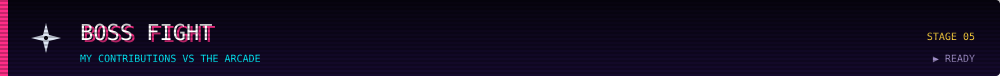

  

  
  
  
  
  

 

I build products **end to end**: the screen you click, the API behind it, the auth that guards it, the database that feeds it and the pipeline that ships it.

My favourite battlefield is **where systems meet**: plugging third-party APIs together, automating business processes that used to be manual, and turning them into tools people actually use in production.

> [!TIP]
> **Current mission:** API integrations and internal tooling on Azure, with Python backends, Azure SQL, Docker and deployments on Render.

> [!IMPORTANT]
> **Looking for party members:** open to full stack, integration and automation roles, and to freelance quests that need to go from idea to production.

 

#### ⚔️ Main weapons

  

  
  
  
  
  
  

#### 🗡️ Secondary weapons

  

  

#### 🎒 Inventory

  

  
  
  

  
<b>🧬 Passive skills</b> (click to expand)

   

- **Enterprise platforms:** SAP S/4HANA, CRM environments, SharePoint, ServiceNow, Microsoft 365
- **Analysis & design:** UML, ERD, architecture diagrams, wireframes and technical documentation
- **Ways of working:** Agile, Scrum, CI/CD
- **AI workflows:** generative AI, human-in-the-loop processes, annotation and AI output evaluation

| Status | Quest | Mission | Loot |
|:---:|---|---|---|
| 🟢 LIVE | **[Synovia Sync](https://synoviasync.com)** | Azure-based platform for business integrations, auth flows and scalable workflows | `Azure` `APIs` `Docker` |
| 🟡 IN PROGRESS | **[Butakeando](https://buta-keando.vercel.app/)** | End-to-end product with frontend, backend, APIs and Stripe payments | `Fullstack` `Stripe` `Vercel` |
| 🟢 LIVE | **[SpainMotorCars](https://spainmotorcars.vercel.app/)** | Frontend car showcase focused on clean, visual UX | `Frontend` `Vercel` |
| 🟢 LIVE | **[Portfolio](https://alvrich.vercel.app)** | Personal site and professional showcase | `Vercel` |
| 🟢 LIVE | **[La Tienda del Break](https://www.latostadora.com/shop/latiendadelbreak/)** | Custom design storefront and creative brand work | `Design` `Branding` |

  

  
  

  <picture>
    <source media="(prefers-color-scheme: dark)" srcset="https://raw.githubusercontent.com/alvrichh/alvrichh/output/pacman-contribution-graph-dark.svg" />
    <source media="(prefers-color-scheme: light)" srcset="https://raw.githubusercontent.com/alvrichh/alvrichh/output/pacman-contribution-graph.svg" />
    
  </picture>

  
<b>🚀 Bonus level: Galaga</b>

   
  

    <picture>
      <source media="(prefers-color-scheme: dark)" srcset="https://raw.githubusercontent.com/alvrichh/alvrichh/output/galaga-contribution-graph-dark.svg" />
      <source media="(prefers-color-scheme: light)" srcset="https://raw.githubusercontent.com/alvrichh/alvrichh/output/galaga-contribution-graph.svg" />
      
    </picture>
  

  <a href="https://alvrich.vercel.app">Portfolio</a> •
  <a href="https://linktr.ee/alvrichh">Linktree</a> •
  <a href="https://www.linkedin.com/in/alvrich">LinkedIn</a> •
  <a href="mailto:alvrodmol@gmail.com">Email</a> •
  <a href="https://codepen.io/alvrichh">CodePen</a> •
  <a href="https://www.instagram.com/arsync.es/?hl=es">Instagram</a>

