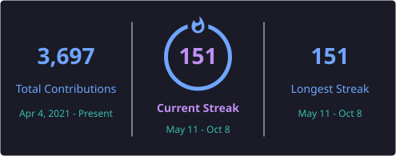

<h1 align="center">Hi, I'm Álvaro 👋</h1>
<h3 align="center">Full Stack Developer • Integration & Automation • Cloud, APIs & Deployment</h3>

  
  
  
  
  

  

### About me

I build products end to end: from the first screen to the API behind it, the auth that protects it, the database that feeds it and the pipeline that ships it.

Most of my day-to-day work lives where systems meet. I connect third-party APIs, automate business processes that used to be manual, and turn them into tools people actually use in production.

> [!NOTE]
> Right now I'm building **API integrations and internal tooling on Azure**: Python backends, Azure SQL, Docker, and deployments on Render.

> [!TIP]
> What I enjoy most: taking a messy manual process, understanding it properly, and turning it into a clean, automated workflow with a UI that makes sense.

> [!IMPORTANT]
> Open to conversations about **full stack, integration and automation roles**, and freelance projects that need to go from idea to production.

 

## What I bring

- **Full stack delivery** — frontend, backend, database and deployment, owned as one piece
- **API integrations** — connecting external services, handling auth, payloads, errors and retries
- **Automation** — replacing repetitive business processes with reliable workflows
- **Auth & security basics done right** — OAuth2, JWT, CORS, HTTPS, sensible data handling
- **Internal tools & dashboards** — practical software for teams, not just demos

## Featured projects

| Project | What it is | Stack |
|---|---|---|
| **[Synovia Sync](https://synoviasync.com)** | Azure-based platform for business integrations, auth flows and scalable workflows | Azure · APIs · Docker |
| **[Butakeando](https://buta-keando.vercel.app/)** | End-to-end product in development with Stripe payments | Frontend · Backend · Stripe · Vercel |
| **[SpainMotorCars](https://spainmotorcars.vercel.app/)** | Frontend car showcase focused on clean, visual UX | Frontend · Vercel |
| **[Portfolio](https://alvrich.vercel.app)** | Personal site and professional showcase | Vercel |
| **[La Tienda del Break](https://www.latostadora.com/shop/latiendadelbreak/)** | Custom design storefront and creative brand work | Design · Branding |

## Stack

### Daily drivers

  

  
  
  
  
  
  

### Also worked with

  

  

  
  
  

### Tools & workflow

  

## Beyond code

- **Enterprise platforms:** SAP S/4HANA, CRM environments, SharePoint, ServiceNow, Microsoft 365
- **Analysis & design:** UML, ERD, architecture diagrams, wireframes and technical documentation
- **Ways of working:** Agile, Scrum, CI/CD
- **AI workflows:** generative AI, human-in-the-loop processes, annotation and AI output evaluation

## GitHub analytics

  
  

  <a href="https://github.com/alvrichh?tab=overview"><b>View native GitHub contributions →</b></a>

  
<b>Extra profile flair</b>

   
  

    
  

## Let's connect

  <a href="https://alvrich.vercel.app">Portfolio</a> •
  <a href="https://linktr.ee/alvrichh">Linktree</a> •
  <a href="https://www.linkedin.com/in/alvrich">LinkedIn</a> •
  <a href="mailto:alvrodmol@gmail.com">Email</a> •
  <a href="https://codepen.io/alvrichh">CodePen</a> •
  <a href="https://www.instagram.com/arsync.es/?hl=es">Instagram</a>

---

  <i>Building ideas end-to-end with code, integrations, automation, and cloud.</i>

