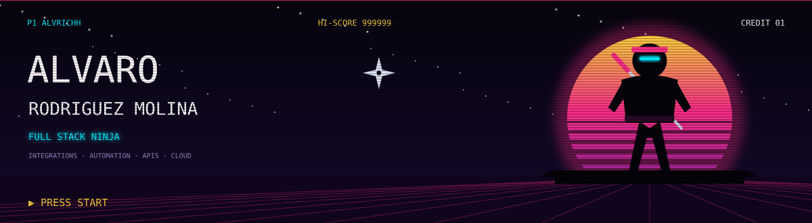
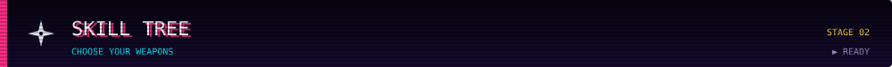
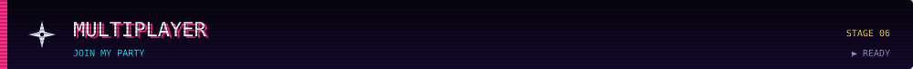
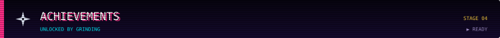

  

  
  
  

I build products **end to end**: from the interface people use to the API behind it, the authentication that protects it, the database that feeds it and the deployment pipeline that ships it.

Most of my work sits **where systems meet**. I integrate third-party APIs, automate business processes that used to be manual, and turn them into reliable tools that people can actually use in production.

> [!NOTE]
> **Current focus:** API integrations and internal tooling on Azure, Python backends, Azure SQL, Docker, authentication flows and modern cloud deployment.

> [!TIP]
> I especially enjoy turning complex or repetitive workflows into clear, maintainable software with a practical user experience.

> [!IMPORTANT]
> Open to conversations about **full stack, integration and automation roles**, as well as freelance projects that need to go from idea to production.

### Core stack

  

  
  
  
  
  
  
  

  
<b>Also worked with</b>

   

  

  

- **Enterprise platforms:** SAP S/4HANA, CRM environments, SharePoint, ServiceNow, Microsoft 365
- **Analysis & design:** UML, ERD, architecture diagrams, wireframes and technical documentation
- **Ways of working:** Agile, Scrum, CI/CD
- **AI workflows:** generative AI, human-in-the-loop processes, annotation and AI output evaluation

| Project | What it is | Stack |
|---|---|---|
| **[Synovia Sync](https://synoviasync.com)** | Azure-based platform for business integrations, authentication flows and scalable workflows | `Azure` `APIs` `Docker` |
| **[Butakeando](https://buta-keando.vercel.app/)** | End-to-end product in development with frontend, backend, APIs and Stripe payments | `Full Stack` `Stripe` `Vercel` |
| **[SpainMotorCars](https://spainmotorcars.vercel.app/)** | Frontend car showcase focused on clean, visual UX | `Frontend` `Vercel` |
| **[Portfolio](https://alvrich.vercel.app)** | Personal site and professional showcase | `Vercel` |
| **[La Tienda del Break](https://www.latostadora.com/shop/latiendadelbreak/)** | Custom design storefront and creative brand work | `Design` `Branding` |

  

  <a href="https://github.com/alvrichh?tab=overview"><b>View native GitHub contributions →</b></a>

  <picture>
    <source media="(prefers-color-scheme: dark)" srcset="https://raw.githubusercontent.com/alvrichh/alvrichh/output/pacman-contribution-graph-dark.svg" />
    <source media="(prefers-color-scheme: light)" srcset="https://raw.githubusercontent.com/alvrichh/alvrichh/output/pacman-contribution-graph.svg" />
    
  </picture>

  <a href="https://alvrich.vercel.app">Portfolio</a>
  &nbsp;•&nbsp;
  <a href="https://www.linkedin.com/in/alvrich">LinkedIn</a>
  &nbsp;•&nbsp;
  <a href="mailto:alvrodmol@gmail.com">Email</a>
  &nbsp;•&nbsp;
  <a href="https://linktr.ee/alvrichh">Linktree</a>
  &nbsp;•&nbsp;
  <a href="https://codepen.io/alvrichh">CodePen</a>

---

  <i>Building ideas end-to-end with code, integrations, automation and cloud.</i>

